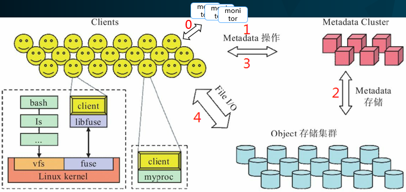

# 一. 操作CephFS
1. ## 建立CephFS
	1. 建立CephFS  
	```
	# ADD A METADATA SERVER
	ceph-deploy mds create micros-k8s-5

	#CREATING POOLS
	ceph osd pool create cephfs_data 160
	ceph osd pool create cephfs_metadata 30

	#CREATING A FILESYSTEM
	ceph ceph fs new cephfs cephfs_metadata cephfs_data

	ceph ceph fs ls
	ceph mds stat	
	```

	1. CephFS 读写过程   
  	
     过程如下：
	> 0.连接监视器，获取最新集群运行图副本。   
	> 1.客户端向MDS发送请求。   
	> 2.MDS向OSD定位该文件所在的文件索引节点。  
	> 3.MDS赋予Client 读/写 和缓存文件内容的权限。  
	> 4.客户端定位到要访问的文件,直接与OSD执行File IO交互。  

1. ## 使用 kernel 驱动挂载 CephFS
	```
	#MOUNT CEPH ceph fs WITH THE KERNEL DRIVER
	sudo mkdir /mnt/ceph_kernel
	# sudo mount -t ceph micros-k8s-6:6789:/ /mnt/ceph_kernel -o name=admin,secret=AQA0qGlbiRSPDRAALdqWHkWrOhmPwaCUY5nA2Q==  #使用密钥环字符串方式
	sudo mount -t ceph micros-k8s-6:6789:/ /mnt/ceph_kernel  -o name=admin,secretfile=/etc/ceph/admin.secret ##使用指定密钥环文件的方式，admin.secret文件中是一个base64编码的字符串
	```
	这个过程实际上是使用 [`mount.ceph`](http://docs.ceph.com/docs/mimic/man/8/mount.ceph/) 应用来完成的。
	
	> **关于内核方式挂载客户端**：
	> 1. 内核客户端作为linux内核的一部分分发，客户端版本取决于内核版本，较旧的内核无法使用（最好4.x以上内核）
    > 1. 客户端内核驱动挂载不能强制配额
	> 1. 客户端内核驱动挂载 性能更好
1. ## 使用 [fuse](./fuse.md) 挂载 CephFS
	```
	#MOUNT CEPH ceph fs USING FUSE
	sudo mkdir -p /etc/ceph
	sudo scp cephuser@micros-k8s-6:/etc/ceph/ceph.conf /etc/ceph/ceph.conf  # 从集群中拉取keyring, Client 默认读 /etc/ceph/ceph.conf 
	sudo scp cephuser@micros-k8s-6:/etc/ceph/ceph.client.admin.keyring /etc/ceph/keyring  # 从集群中拉取keyring, Client 默认读/etc/ceph/ceph.client.admin.keyring,/etc/ceph/ceph.keyring,/etc/ceph/keyring,/etc/ceph/keyring.bin 4个文件只要有一个就可
	sudo yum -y install ceph-fuse
	
	#mount a CephFS as fuse 
	sudo mkdir /mnt/ceph_fuse
	sudo chown cephuser: /mnt/ceph_fuse
	sudo ceph-fuse -m micros-k8s-6:6789 /mnt/ceph_fuse
	# sudo systemctl start ceph-fuse@/mnt.service  #开启ceph-fuse服务
	# sudo systemctl enable ceph-fuse@/mnt.service  #设置ceph-fuse服务开机启动
	# sudo systemctl enable ceph-fuse.target  #设置ceph-fuse服务开机启动
	sudo umount /mnt/ceph_fuse
	```
	> **关于 fuse 方式挂载客户端**：
	> 1. 从用户空间挂载，用户挂载目录即可使用，十分方便
	> 1. 用户空间挂载时，使用文件系统时，要从用户态切换到内核态，有一定的性能损耗

1. ## 使用 fstab 使 CephFS 挂载开机启动
	```
	# using fstab in kernel
	sudo cat <<EOM >> /etc/fstab
	#{ipaddress}:{port}:/ {mount}/{mountpoint} {filesystem-name}     [name=username,secret=secretkey|secretfile=/path/to/secretfile],[{mount.options}]
	micros-k8s-6:6789:/     /mnt/ceph    ceph    name=admin,secretfile=/etc/ceph/secret.key,noatime,_netdev    0       2
	EOM

	# using fstab with fuse
	sudo cat <<EOM >> /etc/fstab
	#DEVICE PATH       TYPE      OPTIONS
	#none    /mnt/ceph  fuse.ceph ceph.id={user-ID}[,ceph.conf={path/to/conf.conf}],_netdev,defaults  0 0
	none    /mnt/ceph  fuse.ceph ceph.id=admin,_netdev,defaults  0 0
	none    /mnt/ceph  fuse.ceph ceph.id=foo,ceph.conf=/etc/ceph/foo.conf,_netdev,defaults  0 0
	EOM
	```

1. ## CephFS Cient 权限管理
	```
	#在服务端admin节点执行
	#ceph ceph fs authorize *filesystem_name* client.*client_name* /*specified_directory* rw
	ceph ceph fs authorize cephfs client.foo / r /bar rw  # 为 foo 客户端设置对 /bar 目录的 rw 权限，对/ 目录的r 权限，并生成密钥环

	client quota df = true  #设置客户端只能查看被限额的容量

	#在 Client 执行
	#Specify a path
	sudo scp cephuser@micros-k8s-6:/etc/ceph/ceph.conf /etc/ceph/ceph.conf 
	sudo scp cephuser@micros-k8s-6:/etc/ceph/client.foo.keyring /etc/ceph/client.foo.keyring 
	sudo mkdir /mnt/ceph_fuse_bar
	sudo chown cephuser: /mnt/ceph_fuse_bar

	sudo ceph-fuse -n client.foo /mnt/ceph_fuse_bar -r /bar   #只能挂载 Client 有权限的目录 
	```
	> **关于 Cient 权限管理**：
	>  1. CephFS 为不同 Client 可以设置访问不同目录的权限
	>  1. 除了 rw 权限，还有 p 权限用于鉴别 Client 是否具有指定某个目录空间大小的权限
	>  1. s 权限用于指定 Client 是否具有在特定目录上 创建/删除 快照的权限

1. ## CephFS 的资源配额管理
	```
	setfattr -n ceph.quota.max_bytes -v 9000000 /mnt/ceph_fuse_bar   # set space to 100 MB
	setfattr -n ceph.quota.max_files -v 10000 /mnt/ceph_fuse_bar  # set files number to 10,000 files

	getfattr -n ceph.quota.max_bytes /mnt/ceph_fuse_bar    # get attributes:ceph.quota.max_bytes
	getfattr -n ceph.quota.max_files /mnt/ceph_fuse_bar    # get attributes:ceph.quota.max_files

	setfattr -n ceph.quota.max_bytes -v 0 /mnt/ceph_fuse_bar  # remove attributes:ceph.quota.max_bytes
	setfattr -n ceph.quota.max_files -v 0 /mnt/ceph_fuse_bar  # remove attributes:ceph.quota.max_files

	sudo umount /mnt/ceph_fuse_bar
	```
	CephFS 允许给系统内的任意目录设置配额，这个配额可以限制目录树中这一点以下的字节数或者文件数。
	> **关于 CephFS 的资源配额**
	> 1. CephFS的配额机制在目录上起作用
	> 1. CephFS的配额机制 依赖于 Client 上的 setfattr 扩展属性，这种配额不严格，不准确
	> 1. 内核客户端的配额功能需要操作系统内核版本在4.17以上

  **局限性**
	 - 配额是合作性的、非对抗性的。 CephFS 的配额功能依赖于挂载它的客户端的合作，在达到上限时要停止写入；无法阻止篡改过的或者对抗性的客户端，它们可以想写多少就写多少。在客户端完全不可信时，用配额防止多占空间是靠不住的。
	 - 配额是不准确的。 在达到配额限制一小段时间后，正在写入文件系统的进程才会被停止。很难避免它们超过配置的限额、多写入一些数据。会超过配额多大幅度主要取决于时间长短，而非数据量。一般来说，超出配置的限额之后 10 秒内，写入会被停掉。
	 - 内核客户端的配额功能需要操作系统内核版本在4.17以上。 用户空间客户端（ libcephfs 、 ceph-fuse ）已经支持配额了。
	 - 基于路径限制挂载时必须谨慎地配置配额。 客户端必须能够访问配置了配额的那个目录的索引节点，这样才能执行配额管理。如果某一客户端被 MDS 能力限制成了只能访问一个特定路径（如 /home/user ），并且它们无权访问配置了配额的父目录（如 /home ），这个客户端就不会按配额执行。所以，基于路径做访问控制时，最好在限制了客户端的那个目录（如 /home/user ）、或者它下面的子目录上配置配额。    

  **与通用文件系统quota对比**
	 - CephFS quota是针对目录的，可限制目录下存放的文件数量和容量
	 - CephFS没有一个统一的UID/GID机制，传统的基于用户和组的配额管理机制很难使用
	 - CephFS一般与应用配合使用，应用自己记录用户信息，将用户关联到对应的CephFS目录

  **多租户配额实现思路**
	>  1. 使用 setfattr 在文件夹上做限额配置[[引用]](http://docs.ceph.com/docs/mimic/cephfs/quota/)，这种配额管理不是严格的。
	>  1. 建立 CephFS 文件系统时，为每个 Client 设置单独的数据池，并指定数据池的大小，这个配额限制更加严格。

1. ## CephFS [管理命令](http://docs.ceph.com/docs/mimic/cephfs/administration/)
	```
	ceph fs new <fs_name> <metadata pool name> <data pool name>   #创建 Ceph 文件系统

	ceph fs ls   #列出所有文件系统
	ceph fs dump   #输出文件系统细节信息
	ceph fs status   #查看所有文件系统状态信息
	ceph fs status  <fs_name> #查看一个文件系统状态信息
	ceph fsid   #列出文件系统集群的 FSID/UUID

	ceph fs rm <fs_name> [--yes-i-really-mean-it]   #删除一个文件系统

	ceph fs reset <fs_name>   #重置一个文件系统，仅限灾难恢复：重置为单MDS映射

	ceph fs get <fs_name>  #获取一个文件系统的主要参数
	ceph fs set <fs_name> <var> <val>  #将一个文件系统的某个参数设成新值

	ceph fs add_data_pool <fs_name> <pool name/id>  #向一个文件系统添加一个新的数据池
	ceph fs rm_data_pool <fs_name> <pool name/id>  #从一个文件系统中移除一个数据池
	```
	如：
	```
	ceph fs set <fs name> max_file_size <size in bytes>   #设置CephFS单个文件占用的最大文件，默认为1TB，设置为0表示无限制
	```
	** 使 Ceph 文件系统下线 **
	```
	ceph fs set <fs_name> down true
	```
	文件系统下线时，mds守护进程同时会下线，进入 standby 状态，日志(jounals)将全部刷进 metadata 池，所有的 Client 读写都会停止(可能需要重启所有挂载的Client)。   
	
	需要上线时：
	```
	ceph fs set <fs_name> down false
	```
	
	需要删除一个文件系统或使一个文件系统下线时，还要防止 standby 的 mds激活已经下线的文件系统：
	```
	ceph fs set <fs_name> joinable false
	```
	也可以使 MDS 的所有 ranks 失败，问价系统将会被遗留并进入 degraded 状态：
	```
	# For all ranks, 0-N:
	ceph mds fail <fs_name>:<n>
	```

	使 mds 进入 standby 状态。如果只有一个 mds ,则 mds 重启。
	```
	mds fail <gid/name/role>
	```

	告诉某个 mds 一个命令，如果要告诉所有 mds ，使用 `mds.*`
	```
	tell mds.<daemon name> command ...
	```

	**一些其他的高级设置**
	Ceph FS 一些其他的高级设置，正常情况不要设置，稍有不慎将造成严重问题，如使 Ceph 文件系统不能使用。
	```
	mds compat rm_compat
	mds compat rm_incompat
	mds compat show
	mds set_state
	mds rmfailed	
	```

1. ## MDS 主要配置

1. ## Client 主要配置

1. ## 日志设置和日志工具
	http://docs.ceph.com/docs/mimic/cephfs/cephfs-journal-tool/
1. ## FILE LAYOUTS

1. ## 客户端驱逐

1. ## 处理文件系统满

1. ## 灾难恢复
1. ## MDS 集群升级
1. ## 目录碎片
1. ## 配置多个活 mds
1. ## 为开发者


# 二. CephFS应用场景
1. ## 提供可靠、稳定、方便的网络数据存储

1. ## 为kubernetes提供pv后端存储
1. ## 在应用级别实现配额管理


# 参考
1. CephFS quota的支持 . https://blog.csdn.net/younger_china/article/details/78163279
1. Kubernetes添加带Quota限额的CephFS StorageClass . https://www.cnblogs.com/ltxdzh/p/9173706.html
1. QUOTAS . http://docs.ceph.com/docs/mimic/cephfs/quota/
1. MDS CONFIG REFERENCE . http://docs.ceph.com/docs/mimic/cephfs/mds-config-ref/
1. Ceph 分布式存储实战

# CheckList
1. 一个集群实现多个 CephFS
1. 单台主机上挂载多块硬盘，将硬盘分区，并做成一个卷组，分给同一个逻辑卷，挂载在同一个 osd 上。
1. 