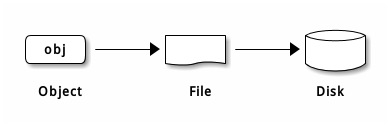
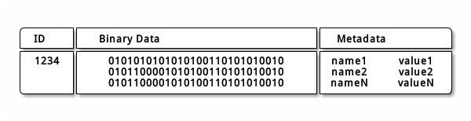
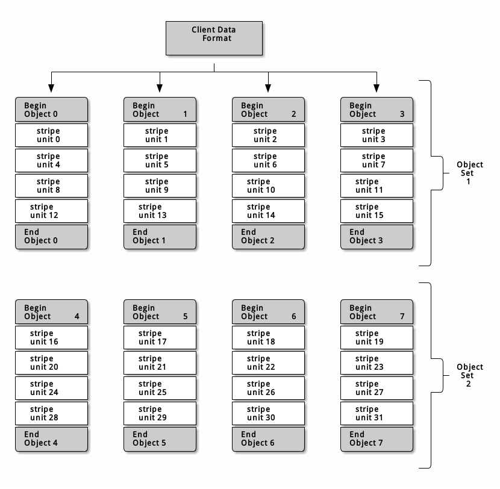
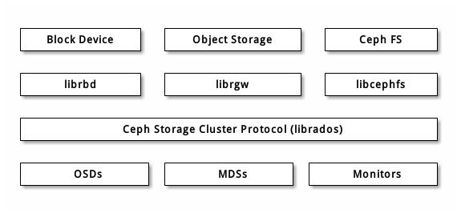

[TOC]
# Ceph架构说明
Ceph 提供了一个可无限伸缩的 Ceph 存储集群，它基于 RADOS ，见论文 [RADOS - A Scalable, Reliable Storage Service for Petabyte-scale Storage Clusters](https://ceph.com/wp-content/uploads/2016/08/weil-rados-pdsw07.pdf) 。  

## CEPH 存储集群
Ceph 存储集群包含两种类型的守护进程：  
- Ceph 监视器 (Monitor)  
- Ceph OSD 守护进程 (OSD)  
Ceph 存储集群从 Ceph 客户端接收数据——不管是来自 Ceph 块设备、 Ceph 对象存储、 Ceph 文件系统、还是基于 librados 的自定义实现——并存储为对象。每个对象是文件系统中的一个文件，它们存储在对象存储设备上。由 Ceph OSD 守护进程处理存储设备上的读/写操作。  
   
Ceph OSD 在扁平的命名空间内把所有数据存储为对象（也就是没有目录层次）。对象包含一个标识符、二进制数据、和由名字/值对组成的元数据，元数据语义完全取决于 Ceph 客户端。例如， CephFS 用元数据存储文件属性，如文件所有者、创建日期、最后修改日期等等。  
  

> Note:  
在传统架构里，客户端与一个中心化的组件通信（如网关、中间件、 API 、前端等等），它作为一个复杂子系统的唯一入口，它引入单故障点的同时，也限制了性能和伸缩性（就是说如果中心化组件挂了，整个系统就挂了）。Ceph 消除了集中网关，允许客户端直接和 Ceph OSD 守护进程通讯。 Ceph OSD 守护进程自动在其它 Ceph 节点上创建对象副本来确保数据安全和高可用性；为保证高可用性，监视器也实现了集群化。Ceph 使用了 CRUSH 算法消除中心节点。

## 存储池(pool)与归置组(PG)
### 关于存储池
Ceph 存储系统支持“池”概念，它是存储对象的逻辑分区。
Ceph 客户端从监视器获取一张集群运行图，并把对象写入存储池。存储池的 size 或副本数、 CRUSH 规则集和归置组数量决定着 Ceph 如何放置数据。
  

存储池至少可设置以下参数：
- 对象的所有权/访问权限；
- 归置组数量；
- 使用的 CRUSH 规则集。

### PG 映射到 OSD  

每个存储池都有很多归置组， CRUSH 动态的把它们映射到 OSD 。 Ceph 客户端要存对象时， CRUSH 将把各对象映射到某个归置组。  
把对象映射到归置组在 OSD 和客户端间创建了一个间接层。由于 Ceph 集群必须能增大或缩小、并动态地重均衡。如果让客户端知道哪个 OSD 有哪个对象，就会导致客户端和 OSD 紧耦合；相反， CRUSH 算法把对象映射到归置组、然后再把各归置组映射到一或多个 OSD ，这一间接层可以让 Ceph 在 OSD 守护进程和底层设备上线时动态地重均衡。下列图表描述了 CRUSH 如何将对象映射到归置组、再把归置组映射到 OSD 。  
   
有了集群运行图副本和 CRUSH 算法，客户端就能精确地计算出到哪个 OSD 读、写某特定对象。  
### 计算 PG ID
Ceph 客户端绑定到某监视器时，会索取最新的集群运行图副本，有了此图，客户端就能知道集群内的所有监视器、 OSD 、和元数据服务器。然而它对对象的位置一无所知。  
**对象位置是计算出来的。**  
客户端只需输入对象 ID 和存储池： Ceph 把数据存在某存储池（如 liverpool ）中。当客户端想要存命名对象（如 john 、 paul 、 george 、 ringo 等等）时，它用对象名，一个哈希值、 存储池中的归置组数、存储池名计算归置组。 Ceph 按下列步骤计算 PG ID：  

客户端输入存储池 ID 和对象 ID （如 pool=”liverpool” 和 object-id=”john” ）；
CRUSH 拿到对象 ID 并哈希它；
CRUSH 用 PG 数（如 58 ）对哈希值取模，这就是归置组 ID ；
CRUSH 根据存储池名取得存储池 ID （如liverpool = 4 ）；
CRUSH 把存储池 ID 加到PG ID（如 4.58 ）之前。  

计算对象位置远快于查询定位， CRUSH 算法允许客户端计算对象应该存到哪里，并允许客户端连接主 OSD 来存储或检索对象。

## 高可用监视器
Ceph 客户端读或写数据前必须先连接到某个 Ceph 监视器、获得最新的集群运行图副本。一个 Ceph 存储集群只需要单个监视器就能运行，但它就成了单一故障点（即如果此监视器宕机， Ceph 客户端就不能读写数据了）。
为增强可靠性和容错能力， Ceph 支持监视器集群；在一个监视器集群内，延时以及其它错误会导致一到多个监视器滞后于集群的当前状态，因此， Ceph 的各监视器例程必须就集群的当前状态达成一致。Ceph 总是使用大多数监视器（如： 1 、 2:3 、 3:5 、 4:6 等等）和Paxos 算法就集群的当前状态达成一致。
关于配置监视器的详情，见监视器配置参考。

## 高可用性认证
为识别用户并防止中间人攻击， Ceph 用 cephx 认证系统来认证用户和守护进程。但 cephx 协议不解决传输加密（如 SSL/TLS ）、或者存储加密问题。
Cephx 用共享密钥来认证，即客户端和监视器集群各自都有客户端密钥的副本。这样的认证协议使参与双方不用展现密钥就能相互认证，就是说集群确信用户拥有密钥、而且用户相信集群有密钥的副本。
Ceph 一个主要伸缩功能就是避免了对象存储的中央接口，这就要求 Ceph 客户端能直接和 OSD 交互。 Ceph 通过 cephx 认证系统保护数据，它也认证运行 Ceph 客户端的用户， cephx 协议运行机制类似 Kerberos 。

## 支撑超大规模
在很多集群架构中，集群成员的主要目的就是让集中式接口知道它能访问哪些节点，然后此中央接口通过一个两级调度为客户端提供服务，在 PB 到 EB 级系统中这个调度系统必将成为最大的瓶颈。Ceph 消除了此瓶颈：其 OSD 守护进程和客户端都能感知集群，比如 Ceph 客户端、各 OSD 守护进程都知道集群内其他的 OSD 守护进程，这样 OSD 就能直接和其它 OSD 守护进程和监视器通讯。另外， Ceph 客户端也能直接和 OSD 守护进程交互。

## CEPH 协议
Ceph 客户端用原生协议和存储集群交互， Ceph 把此功能封装进了 librados 库，这样就能创建自己的定制客户端了。  
  
现代程序都需要可异步通讯的简单对象存储接口。 Ceph 存储集群提供了一个有异步通讯能力的简单对象存储接口，此接口提供了直接、并行访问集群对象的功能。

- 存储池操作；
- 快照和写时复制克隆；
- 读/写对象； 创建或删除； 整个对象或某个字节范围； 追加或裁截；
- 创建/设置/获取/删除扩展属性；
- 创建/设置/获取/删除键/值对；
- 混合操作和双重确认；
- 对象类。

## 数据条带化（高性能写入）
存储设备都有吞吐量限制，它会影响性能和伸缩性，所以存储系统一般都支持条带化（把连续的信息分片存储于多个设备）以增加吞吐量和性能。数据条带化最常见于 RAID 中， RAID 中最接近 Ceph 条带化方式的是 RAID 0 、或者条带卷， Ceph 的条带化提供了像 RAID 0 一样的吞吐量、像 N 路 RAID 镜像一样的可靠性、和更快的恢复。
Ceph 提供了三种类型的客户端：块设备、文件系统和对象存储。 Ceph 客户端把展现给用户的数据格式（一块设备映像、 REST 风格对象、 CephFS 文件系统目录）转换为可存储于 Ceph 存储集群的对象。
> Tip：在 Ceph 存储集群内存储的那些对象是没条带化的。 Ceph 对象存储、 Ceph 块设备、和 Ceph 文件系统把他们的数据条带化到 Ceph 存储集群内的多个对象，客户端通过 librados 直接写入 Ceph 存储集群前必须先自己条带化（和并行 I/O ）才能享受这些优势。

在下图中，客户端数据条带化到一个对象集（下图中的 object set 1 ），它包含 4 个对象，其中，第一个条带单元是 object 0 的 stripe unit 0 、第四个条带是 object 3 的 stripe unit 3 ，写完第四个条带，客户端要确认对象集是否满了。如果对象集没满，客户端再从第一个对象起写入条带（下图中的 object 0 ）；如果对象集满了，客户端就得创建新对象集（下图的 object set 2 ），然后从新对象集中的第一个对象（下图中的 object 4 ）起开始写入第一个条带（ stripe unit 16 ）。  

三个重要变量决定着 Ceph 如何条带化数据：  
* 对象尺寸： Ceph 存储集群里的对象有最大可配置尺寸（如 2MB 、 4MB 等等），对象尺寸必须足够大以便容纳很多条带单元、而且应该是条带单元的整数倍。  
* 条带宽度： 条带都有可配置的单元尺寸（如 64KB ）。 Ceph 客户端把数据等分成适合写入对象的条带单元，除了最后一个。条带宽度应该是对象尺寸的分片，这样对象才能 包含很多条带单元。  
* 条带数量： Ceph 客户端把一系列条带单元写入由条带数量所确定的一系列对象，这一系列的对象称为一个对象集。客户端写到对象集内的最后一个对象时，再返回到第一个。  

> **Important：把集群投入生产环境前要先测试条带化配置的性能，因为把数据条带化到对象中之后这些参数就不可更改了。**
  
## CEPH 客户端（Client）
Ceph 客户端包括数种服务接口，有：  
- 块设备： Ceph 块设备（也叫 RBD ）服务提供了大小可调、精炼、支持快照和克隆的块设备。为提供高性能， Ceph 把块设备条带化到整个集群。 Ceph 同时支持内核对象（ KO ） 和 QEMU 管理程序直接使用``librbd`` ——避免了内核对象在虚拟系统上的开销。  
- 对象存储： Ceph 对象存储（也叫 RGW ）服务提供了 `RESTful 风格`的 API ，它与 Amazon S3 和 OpenStack Swift 兼容。  
- 文件系统： Ceph 文件系统（ CephFS ）服务提供了兼容 POSIX 的文件系统，可以直接 mount 或挂载为用户空间文件系统（ FUSE ）。  
Ceph 能额外运行多个 `OSD` 、 `MDS` 、和监视器来保证伸缩性和高可靠性，下图描述了高级架构。  
   

### RBD
Ceph 块设备把一个设备映像条带化到集群内的多个对象，其中各对象映射到一个归置组并分布出去，这些归置组会分散到整个集群的 ceph-osd 守护进程上。  
**条带化会使 RBD 块设备比单台服务器运行的更好！**  

### RGW 
Ceph 对象存储守护进程， radosgw ，是一个 FastCGI 服务，它提供了 `RESTful 风格`_ HTTP API 用于存储对象和元数据。它位于 Ceph 存储集群之上，有自己的数据格式，并维护着自己的用户数据库、认证、和访问控制。 RADOS 网关使用统一的命名空间，也就是说，你可以用 OpenStack Swift 兼容的 API 或者 Amazon S3 兼容的 API ；例如，你可以用一个程序通过 S3 兼容 API 写入数据、然后用另一个程序通过 Swift 兼容 API 读出。

> **S3/Swift 对象和存储集群对象比较**  
Ceph 对象存储用对象这个术语来描述它存储的数据。 S3 和 Swift 对象不同于 Ceph 写入存储集群的对象， Ceph 对象存储系统内的对象可以映射到 Ceph 存储集群内的对象； S3 和 Swift 对象却不一定 1:1 地映射到存储集群内的对象，它有可能映射到了多个 Ceph 对象。

### CephFS 
Ceph 文件系统（ Ceph FS ）提供与 POSIX 兼容的文件系统服务，坐于基于对象的 Ceph 存储集群之上，其内的文件被映射到 Ceph 存储集群内的对象。客户端可以把此文件系统挂载在内核对象或用户空间文件系统（ FUSE ）上。  
   
Ceph 文件系统服务包含随 Ceph 存储集群部署的元数据服务器（ `MDS` ）。 `MDS` 的作用是把所有文件系统元数据（目录、文件所有者、访问模式等等）永久存储在相当可靠的元数据服务器中内存中。 `MDS` （名为 ceph-MDS 的守护进程）存在的原因是，简单的文件系统操作像列出目录（ ls ）、或进入目录（ cd ）这些操作会不必要的扰动``OSD``。所以把元数据从数据里分出来意味着 Ceph 文件系统能提供高性能服务，又能减轻存储集群负载。
Ceph FS 从数据中分离出了元数据、并存储于 `MDS` ，文件数据存储于存储集群中的一或多个对象。 Ceph 力争兼容 POSIX 。 ceph-MDS 可以只运行一个，也可以分布于多台物理机器，以获得高可用性或伸缩性。
- 高可用性： 多余的 ceph-MDS 例程可处于 standby （待命）状态，随时准备替下之前处于 active （活跃）状态的故障 ceph-MDS 。这可以轻易做到，因为所有数据、包括日志都存储在 RADOS 上，这个转换过程由 ceph-mon 自动触发。
- 伸缩性： 多个 ceph-MDS 例程可以同时处于 active 状态，它们会把目录树拆分为子树（和单个热点目录的分片），在所有活跃服务器间高效地均衡负载。
## 注意问题
1. 使用 cephx 时不会有单点故障或瓶颈?
1. 客户端用 CRUSH 算法算出对象应存到哪里，并把对象映射到存储池和归置组，然后查找 CRUSH 图来确定此归置组的主 OSD 
1. 把集群投入生产环境前要先测试条带化配置的性能，因为把数据条带化到对象中之后这些参数就不可更改了。

# 资料参考
1. [Ceph 体系结构 . http://docs.ceph.org.cn/architecture/](http://docs.ceph.org.cn/architecture/)

