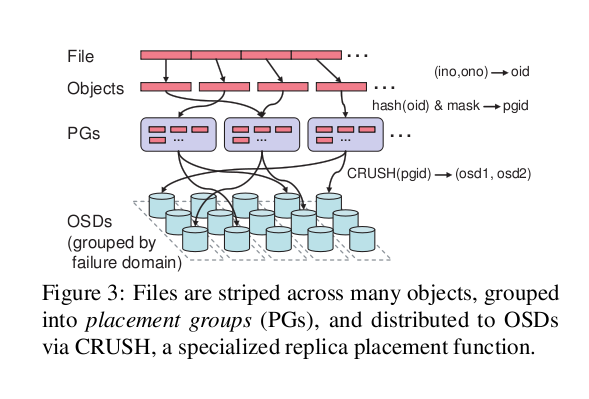

# PG
PG（放置组）
概述PG =“归置组”。将数据放入集群时，对象将映射到PG，并将这些PG映射到OSD。(**可以理解成目录**)    
增加PG的数量可以减少集群中每个OSD负载的差异，但每个PG在存储它的OSD上需要更多的CPU和内存。

映射算法图   
   

1. 一个PG是否代表固定数量的存储空间？
每个对象都映射到一个PGs。一个PG映射到单个OSD列表，其中列表中的第一个是主要的，其余是副本。

许多PG可以映射到一个OSD。

## 计算 PG ID
Ceph 客户端绑定到某监视器时，会索取最新的集群运行图副本，有了此图，客户端就能知道集群内的所有监视器、 OSD 、和元数据服务器。然而它对对象的位置一无所知。
对象位置是计算出来的。   
客户端只需输入对象 ID 和存储池：Ceph 把数据存在某存储池（如 liverpool ）中。当客户端想要存命名对象（如 john 、 paul 、 george 、 ringo 等等）时，它用对象名，一个哈希值、 存储池中的归置组数、存储池名计算归置组。 
```
Ceph 按下列步骤计算 PG ID：
  1.客户端输入存储池 ID 和对象 ID （如 pool=”liverpool” 和 object-id=”john” ）；
  1.CRUSH 拿到对象 ID 并哈希它；
  1.CRUSH 用 PG 数（如 58 ）对哈希值取模，这就是归置组 ID ；
  1.CRUSH 根据存储池名取得存储池 ID （如liverpool = 4 ）；
  1.CRUSH 把存储池 ID 加到PG ID（如 4.58 ）之前。
```
不管crush算法本身，计算伪代码如下：
```
locator = object_name
obj_hash = hash(locator)
pg = obj_hash % num_pg
osds_for_pg = crush(pg)  # returns a list of osds
primary = osds_for_pg[0]
replicas = osds_for_pg[1:]
```
计算对象位置远快于查询定位， CRUSH 算法允许客户端计算对象应该存到哪里，并允许客户端连接主 OSD 来存储或检索对象。
pg到osd的映射过程，伪代码：
```
def crush(pg):
   all_osds = ['osd.0', 'osd.1', 'osd.2', ...]
   result = []
   # size is the number of copies; primary+replicas
   while len(result) < size:
       r = hash(pg)
       chosen = all_osds[ r % len(all_osds) ]
       if chosen in result:
           # osd can be picked only once
           continue
       result.append(chosen)
   return result
```

# 参考
1. https://blog.csdn.net/skdkjzz/article/details/41007905
