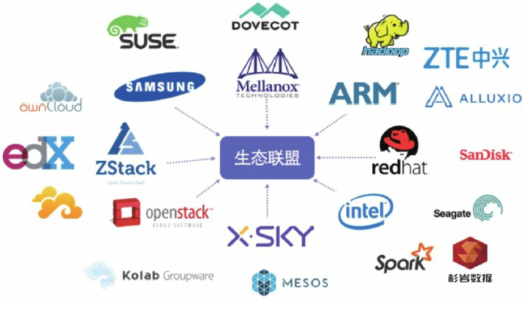

1. # 部署
 1. 简介
 Ceph是可靠的、可扩展的、统一的、分布式的存储系统。Ceph可以同时提供对象存储RADOSGW、块存储RBD、文件系统存储CephFS 3种功能，以此来满足不同的应用需求。   
 	```
 	主要设计特性：
 		* 集群可靠性：用户写入数据不丢失，断电数据不丢失
 		* 集群可扩展性:系统规模和存储容量随系统节点数增加和聚合数据访问带宽增加线性扩展
 		* 接口统一性:支持3种存储：块存储、对象存储和文件存储，支持市面上所有流行的存储类型
 		* 使用廉价存储设备，充分发挥廉价存储设备的计算能力
 		* 去除中心点，避免单点故障
	```

 	1. 应用场景
	 	Ceph可以提供对象存储、块设备存储和文件系统服务。对象存储可以对接网盘（owncloud）应用业务等；块设备存储可以对接（IaaS），例如主流的IaaS云平台软件，如OpenStack、CloudStack、Zstack、Eucaly ptus等以及KVM等;CephFS兼容 POSIX ，可以很方便的挂载在用户文件系统上。
	 	
 	1. 架构
	 	- **最底层的分布式对象存储系统RADOS**
	 	- **分布式对象存储系统RADOS库，即LIBRADOS**
		- **基于LIBRADOS实现的兼容Swift和S3的存储网关系统RADOSGW**
		- **基于LIBRADOS实现的块设备驱动RBD**
		- **兼容POSIX的分布式文件系统CephFS**
	
 	1. 概念
 1. CephFS 快速部署
	
1. # 应用
 1. CephFS 用途
 	1. 已有案例   
 		   
		
		[CERN,DreamHost,Yahoo Flick,Ceph厂商（如SanDisk、XSKY、H3C、杉岩数据、SUSE和Bigtera），腾讯、京东、新浪微博、乐视、完美世界、平安科技、联想、唯品会、福
	彩网和魅族等](./usergroup.md)
 	1. 业务结合
 		- 联调 Kubernetes,作为容器集群存储后端
 		- 多(团队)租户，为每个团队建立建立单独的资源存储器

 1. FAQ
		1. kernal client 和 fuse client 的区别
		1. cephFS如何配额
			- 思路1：使用 setfattr 在文件夹上做限额配置[引用]，这种配额管理不是严格的。
			- 思路2：建立 CephFS 文件系统时，为每个 Client 设置单独的数据池，并指定数据池的大小，这个配额限制更加严格。（依赖Ceph的实验属性，不上生产环境）
1. # 调优
	1. 创建存储池时设置合适的pg数
1. # 灾备

1. # CephFS 优缺点/展望
	1. 对比 NFS
	1. 对比 HDFS
